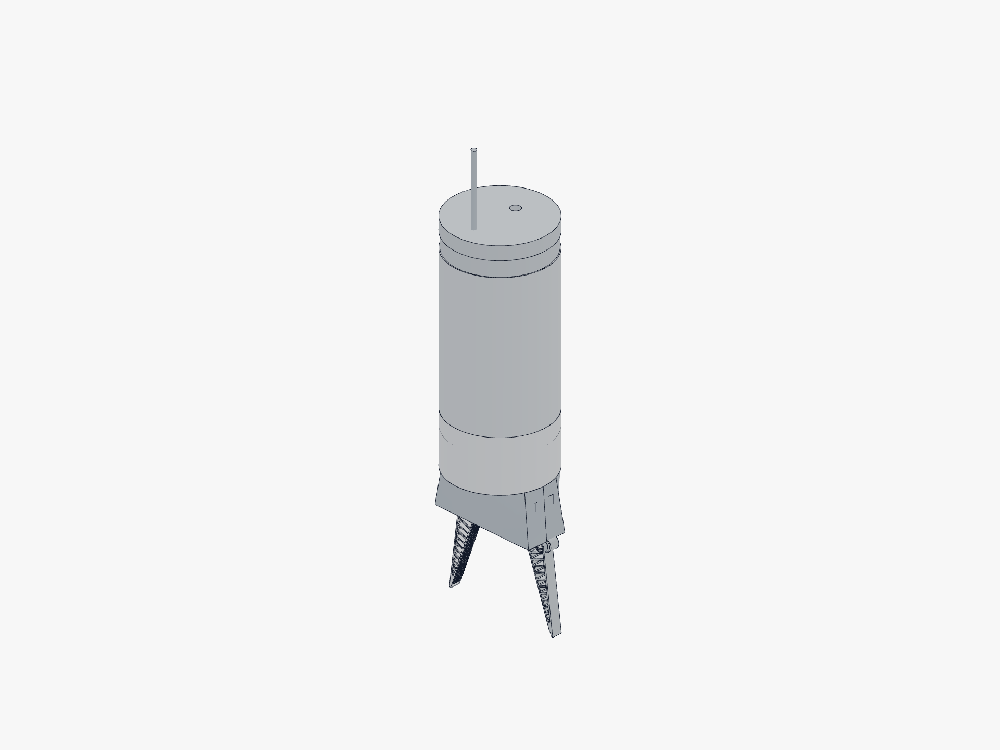
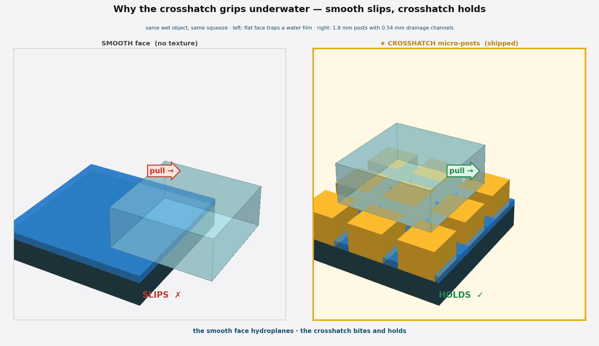
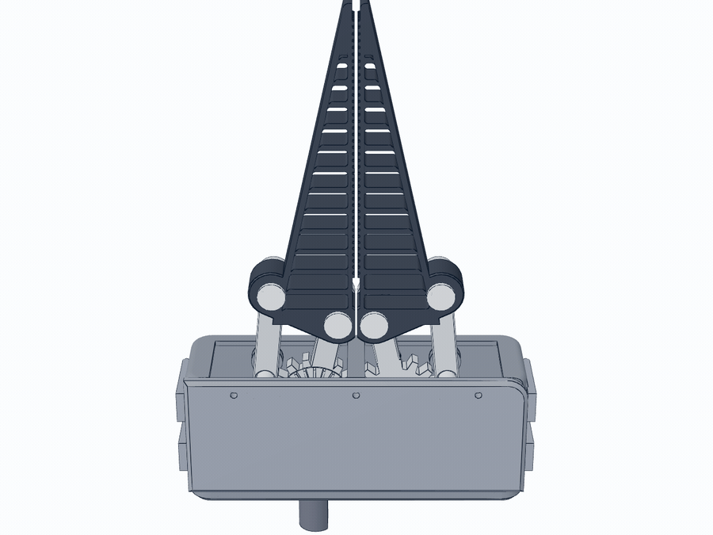
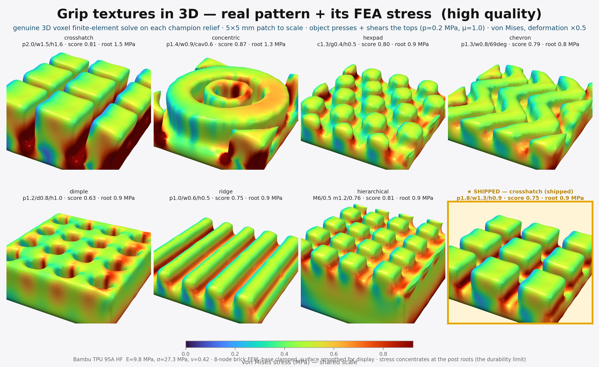

# SoftSense — underwater self-sensing soft gripper

> 🏆 **Project complete (July 2026) — prize winner.** The full SoftSense project
> took home a prize at its competition. This repository is the finished,
> consolidated record: parametric CAD, FEA campaigns, the grip-texture and
> actuator studies, print profiles, ESP32 firmware and the Orange Pi
> controllers — everything in one place. (Formerly `gripper-cad`; the old
> GitHub URL redirects. The judge-facing engineering document is
> `SoftSense_Innovations_Documentation.docx`.)

<p align="center">
  
  
  <br>
  
  
</p>

A robotic gripper with working single-DOF motion: **rotate one input shaft and
both fingers open/close symmetrically, splaying outward as they open.** The
jaws are **Fin Ray-style compliant fingers** (3D-printed in TPU with a
crosshatch micro-post grip texture) that bend and wrap *around* a grasped
object. The gear/linkage drive lives in a **flooded enclosure** designed for
**underwater** use (drain/flood holes, corrosion-resistant material choices —
`docs/UNDERWATER.md`).

**The SoftSense idea:** there is no dedicated force sensor. The **actuator is
the grip-force sensor** — motor current → torque → tip force through the
calibrated kinematic chain (`motor/SENSING.md`). The printed drivetrain is the
structural limit (`T_safe`), and the motor's current limit is its protection.

## Mechanism (one DOF)

- Two equal **spur gears** mesh on the centreline. The left gear (A_L) is
  driven through a **90° straight bevel pair**: a 12-tooth bevel gear fused on
  A_L's +Z face, driven by an integral 6-tooth bevel pinion (2.0 ratio,
  **module 1.8, 25° PA** — deliberately coarse, thick teeth from the gear-FEA
  strength pass) on a vertical **Ø15 input shaft**, so the drive **enters the
  housing from the bottom** while the fingers point up. The mesh
  counter-rotates the right gear: one shaft moves both fingers as a mirror pair.
- The input shaft's bottom end carries a **female Feetech 25T spline socket**
  (Ø5.9 serration, press-fit) — a **Feetech STS3250** bus servo presses
  straight in, no adapter horn. Caliper-verify the spline and print the fit
  coupon before committing (`gripper.py`, `SPLINE_*`).
- Each gear is the **crank of a non-parallelogram four-bar linkage**; the
  finger is rigid with the coupler. The link lengths give translate-apart
  **+ ~18° outward splay** over the travel, clear of any four-bar dead-point.
- Travel: closed (jaw faces ~1.6 mm apart) → open (~60 mm at the base,
  ~118 mm at the fingertips) at 1× scale.

## Fin Ray fingers (TPU)

Each finger is a compliant triangular truss — thin 1.2 mm contact beam, sharply
tapered 1.8 mm spine, 14 fine reversed-slant ribs — chosen by **multi-shape FEA**
to grasp **universally**: it distributes contact pressure along the whole finger
on flat/large objects and grips round objects evenly across a wide size range
(`fea/UNIVERSAL_FINGER.md`). The contact face carries a **crosshatch micro-post
grip texture** (1.8 mm posts + 0.54 mm drainage channels) — the empirical winner
among textures that actually tile the 10 mm blade, chosen by a wet-grip physics
model + sensitivity campaign with an honestly-documented override of the model's
raw winner (`grip/GRIP_TEXTURE.md §5`). Printed in **Bambu TPU 95A HF**
(measured ISO 527 data; ether-based TPU recommended for sustained immersion).

## Enclosure (flooded, underwater)

Rounded hollow housing; the vertical input shaft exits through two journal
bearings in the bottom wall, surrounded by a mounting flange with **4 × M4
bolt holes**. **Drain/flood holes** let it flood and drain — no trapped air,
pressure equalizes with depth. Top slots are sized to the measured arm sweep.

## Electronics & control

| Where | What |
|---|---|
| `firmware/` | **ESP32 controller (the shipped one)** — Waveshare General Driver for Robots. Boots its own Wi-Fi AP + captive web UI (OPEN/CLOSE, slider, live position/load/voltage/temp, on-flash calibration), drives the STS3250 on the built-in bus-servo port. **Stop-on-load** (gentle stop-on-contact) ported from the Pi controller. |
| `firmware/gamepad/` | **DualSense bridge** — a laptop-side script + page that turns a PS5 pad into a jog controller via the firmware's `/api/jog`. |
| `opi/` | **Orange Pi controllers** (3 LTS Wi-Fi-AP appliance + Ethernet-only Orange Pi PC/H3 variant) — the original offline web controller with stop-on-load, vendored pyserial, provisioning + deploy scripts. Superseded by the ESP32 after the Pi died, kept as a complete working alternative. |
| `motor/` | The **actuator & sensing study**: requirements → 12-agent survey → weighted selection (±50% sensitivity). Depth-rated pick: DYNAMIXEL XW540-T260; the built demonstrator runs the Feetech STS3250 direct-spline mount. Power chains per interface in `motor/POWER_SUPPLY.md`. |

## Repository map

| Path | What it is |
|---|---|
| `gripper.py` | **Source of truth** — parametric build123d generator + four-bar solver + Fin Ray finger + enclosure. Env: `GRIPPER_OPEN` 0–1 (pose), `GRIPPER_FINGER_SCALE` 0.6–2.5, `GRIPPER_SCALE` (whole-gripper scale-up). |
| `docs/TESTING_AND_SIMULATION.md` | **How everything was tested & simulated** — judge-facing account of every simulation, its physics, what it proves, fidelity honesty, reproduce commands. Start here for "how do you know it works?". |
| `docs/` | Engineering guides: assembly, BOM, DFM, underwater, printing, print profiles, materials, testing, scale-up (`SCALE_UP.md`), the overnight honest-framing fixes (`OVERNIGHT_FIXES.md`). |
| `fea/` | **Finger FEA campaign** — universal-finger study, scalability, underwater crush, decision log (~90 runs), 3D corotational contact solver (CPU+GPU). |
| `grip/` | **Grip-texture campaign** — wet-grip surrogate model, sweep + ±50% sensitivity, Tier-2 contact FEA, literature validation gate, decision log. |
| `motor/` | **Actuator/sensing/integration campaign** — requirements, survey, selection, drivetrain gear FEA (`T_safe`), force-via-current sensing, electrical, ROV integration, bench-test plan, FMEA, mounting-interface dossiers + 7 modelled adapters (`motor/cad/adapters/`), power supply. |
| `parts/` + `output/` + `print_plates/` | Per-part STEP/STL exports (with `MANIFEST.md`), material-labelled print set, and plate STLs. |
| `variants/scale_1.5x/`, `variants/scale_2.0x/` | **Scaled-up variants** (fully re-simulated; parts + plates + 3MF print-ready). See `docs/SCALE_UP.md`. |
| `profiles/` | Importable Bambu Studio filament + process profiles (TPU 95A HF on P1S, 0.4 mm hardened nozzle). |
| `derived/` | Regenerable assemblies: static poses (`gripper_{closed,mid,open}.step`) + interactive slider STEPs. |
| `renders/` | Final animations, heroes, FEA montages, adapter snapshots. |
| `motor/cad/output/system_assembly_T2_*.step` | **Full integrated system** (gripper + canister + servo + shaft + seal + penetrators), one STEP per servo option. |
| `firmware/`, `opi/` | Controllers — see table above. |
| `scripts/`, `regen.sh` | Export/plate/render helpers; `./regen.sh` rebuilds all derived artifacts. |
| `SoftSense_Innovations_Documentation.docx` | The competition documentation deliverable. |

## Print & build

**25 printed parts, zero purchased hardware, zero fasteners** — the only tool
is a soldering iron. 9 structural parts (PA12-GF rigid set + TPU fingers), the
one-piece `input_pinion_shaft` (bevel pinion + Ø15 shaft + STS3250 spline
socket), 8 heat-stake pins and 8 retaining caps (PETG-HF): each journal pin is
retained by a cap melted over its stud into a thermal-rivet head wider than
the bore. Print settings + rationale: `docs/PRINT_PROFILE_P1S_TPU.md`,
`docs/PRINTING.md`, `docs/DFM.md`.

## Regenerate / re-pose

```bash
source /home/andre/.cad-venv/bin/activate          # build123d + OCP toolchain
STEP=/home/andre/.claude/skills/cad/scripts/step
GRIPPER_OPEN=0.7 python $STEP gripper.py -o derived/gripper_open70.step   # any pose 0..1
GRIPPER_SCALE=1.5 python $STEP gripper.py -o derived/gripper_15x.step     # scaled build
python gripper.py                                  # numeric kinematic self-check
./regen.sh                                         # full rebuild (poses + parts + plates + renders)
```

The FEA solver has a CuPy GPU backend (`GRIPPER_FEA_GPU=1`), but at these mesh
sizes (≤25k DOF) CPU is faster — the GPU only wins past ~100k DOF.

### Interactive viewer

Open `derived/gripper_interactive.step` in CAD Explorer and drag the **`open`**
slider (= turning the shaft); mesh and edges move together live.

## Coordinate convention

`X` = jaw open/close (right +), `Y` = toward fingertips (up +),
`Z` = depth = revolute & gear axes. Units: mm.

## Assumptions / caveats

- **Off-centre drive.** A single shaft drives both jaws symmetrically only if
  the two gears mesh each other, so the input enters at the left pivot (A_L);
  the right-angle bevel stage redirects it to the vertical bottom-exit shaft
  without changing the finger kinematics.
- **Fin Ray-style, not Festo's patented variant** — the generic
  adaptive-compliant slanted-rib truss principle, not the *Fin Ray Effect®*
  tooth-shape variant.
- Gear tooth forms are **representative** (straight-flank, clean meshing pitch
  circles), not production involutes — coupon-tunable for backlash/contact
  before a real run. The STS3250 spline socket dims are research-inferred:
  **caliper-verify a real servo + print the fit coupon first.**
- Real compliant grip (wrap-around) is a TPU material behaviour — the CAD
  shows the undeformed finger; the motion model opens/closes it rigidly.
- Dimensions were inferred from one reference image, not measured hardware.

## Honest framing on the published headlines

- The finger-FEA **12 N target** is a **stress-probe load** used to rank
  finger designs, **not** an operating force the drivetrain delivers. The
  printed right-angle stage caps input torque at `T_safe` — quantified on the
  crown-era teeth at ≈ 0.013 N·m (radial 2D) / 0.034 N·m (single-station 2D),
  mapping to a per-finger **operating band of 0.14 – 0.73 N**. The shipped
  bevel pair was upsized (module 1.0 → 1.8, ~+90 % tooth thickness) by the
  same strength pass and should raise that ceiling, but **the only bench-grade
  number is the printed-coupon torque-to-failure test** in
  `motor/BENCH_TEST.md`. Run `motor/scripts/drivetrain_force_envelope.py` for
  live numbers.
- The "**5.7 – 8.6× safety margin**" was computed with linear tetrahedra that
  volumetrically lock near ν = 0.5; the locking-stable P2 re-run puts the
  corrected margin nearer **3.8 – 5.7×** at the 12 N probe — and ≈ **120 – 365×**
  at the actual drivetrain-deliverable force. Design call unchanged; the
  absolute number is corrected (`docs/OVERNIGHT_FIXES.md`).
- The Tier-1 grip-texture model is **rank-only**, its literature gate is a
  sufficient-condition check, and the shipped crosshatch won only after a
  documented geometric-tileability override of the model's raw winner
  (`grip/GRIP_TEXTURE.md §5`, `grip/GRIP_MODEL.md`).
- `T_safe` is a 2D upper bound; the right-angle stage is genuinely 3D and
  straight-flank teeth will gall/edge-load in PA12-GF rather than roll
  cleanly. Bench coupons are the ceiling that counts.

## License

**CC BY-NC-ND 4.0** — you may view, download, build, and share this work
**with attribution, for non-commercial purposes, without distributing
modified versions**. Commercial use and derivative redistribution rights are
reserved; contact the author to arrange a commercial license. See `LICENSE`.
