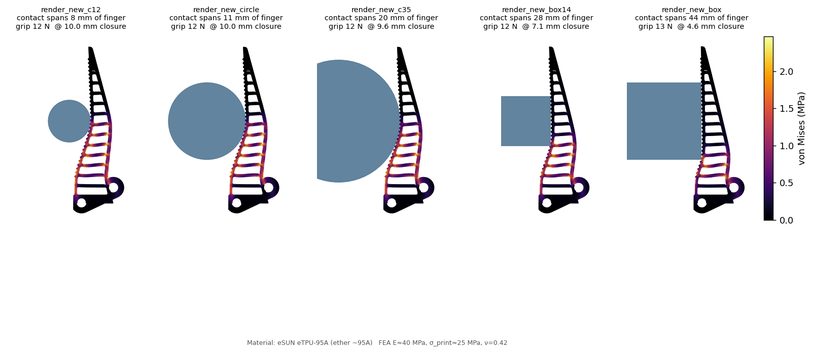
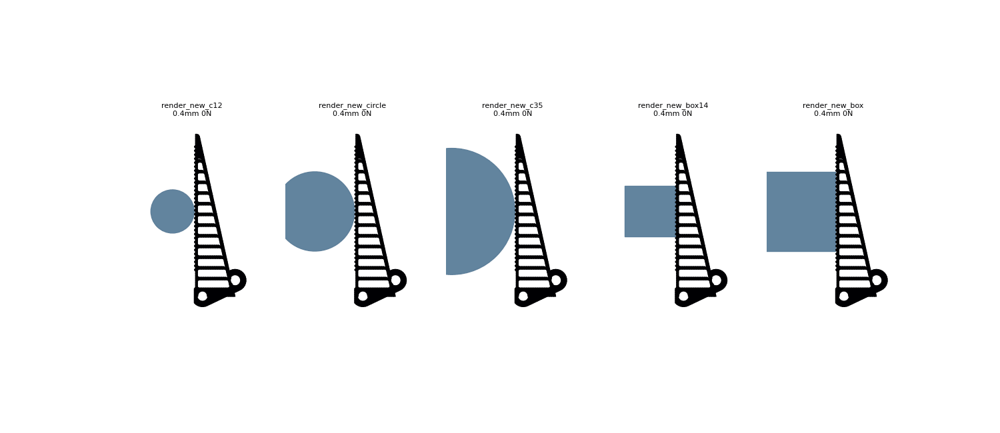
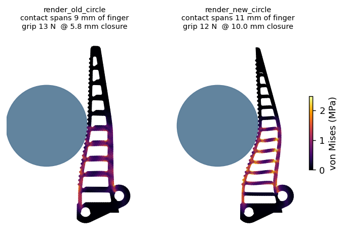
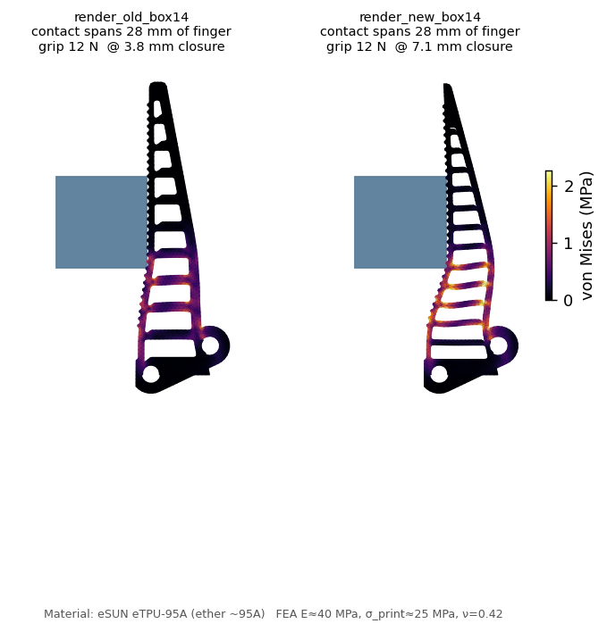

# Universal gripper finger — complete decision log

A full chronological record of the finger redesign: every approach tried, the data
behind each decision, the dead ends and *why* they were dead, and the final shipped
design. Companion to the summary in `fea/UNIVERSAL_FINGER.md`; this file is the long
form with the reasoning and numbers for every fork.

All FEA uses the 3D corotational linear-tet contact solver clamped at the two pin
bores C, D (the real coupler mount), TPU E=9.8 MPa (Bambu TPU 95A HF, in-plane ISO 527) / ν=0.42, strength
27.3 MPa. Harness: `fea/scripts/iter_harness.py`. Scorer: `fea/scripts/eval_finger.py`.
Every named run below has a directory under `fea/iterations/<name>/` with its
`eval.json`/`metrics.json` and (for renders) `wrap_render.png` + `wrap_anim.gif`.

> ⚠️ **What "12 N" means throughout this log.** Every "12 N grip" reference
> below is a **stress-probe load** used to fairly rank finger designs at a
> closure the FEA can reach in software. It is **not** the operating force
> the shipped drivetrain can safely deliver — the printed crown/pinion gear
> caps the per-finger force at ≈ 0.14–0.73 N (run
> `motor/scripts/drivetrain_force_envelope.py` for the live numbers).
> The published 5.7–8.6× vM margins are at the 12 N probe; the implied
> margin at the operating force is ≈ 100–700× (small-strain linear scaling).
> The design rank ordering is preserved at any sub-`T_safe` load. See
> `docs/TESTING_AND_SIMULATION.md §A.8 / A.12 / C.4` for the full framing
> and `OVERNIGHT_FIXES.md #1` for the propagation through the doc stack.

---

## 0. Starting point & the user's actual goal

The complaint: on the original 3D FEA the grasp load all sat in the lower-mid ribs;
the **top of the finger carried nothing** and the finger never **morphed over the
object**. The goal restated by the user, in order of how it sharpened:

1. "Distribute pressure across the whole finger" + "morph over the object."
2. (later, decisive) "It has to work on **all** types of shapes, not just circles —
   every shape, every size."
3. (earlier project goal, which became a hard constraint) **fool-proof, no
   maintenance, underwater.**

That third point is what ultimately rules out tendon mechanisms — see §11.

---

## 1. Dead end #1 — concave contact face matched to the object

**Idea:** a straight contact face on a round object can only tangent-kiss in one
short band (confirmed: the production finger contacts a Ø44 cylinder over only
~6.6 mm of its length, all in the mid third, `top_third_force_frac = 0`). So bow the
contact face into a **circular arc concentric with the object** → every face point
the same distance from the object centre → uniform radial penetration → even
pressure, and the arc span *is* the wrap.

**What happened (`cc0_proto`, `cc1_solid`):** built a concave-cup finger; ran FEA.
The cup contacted **only at the lower lip** (4 nodes at y≈62.7) and the rest of the
arc **swung open +15 mm** — both the hollow and the solid versions failed
identically. Diagnostic (displacement growing neck +0.4 → lower-lip +3.5 → upper-lip
+12.8 mm) showed the slender neck between the bracket and the cup acts as a flexible
hinge: the object pushes the cup and it rotates off like a door. A concave
*cantilever* is no better than a straight one — the truss load path (ribs tying the
face to the mount-anchored spine) had been thrown away.

**Killed by the user, correctly:** even if the cup were fixed, a face matched to
R=22 is **overfit** — it seats badly on a square, a small peg, or a large jar. A
universal gripper cannot use object-matched geometry. The entire concave branch was
reverted (`gripper.py` back to the clean w7 finger; `FR_CONTACT_ARC` etc. removed).

---

## 2. The reframe — universality is a *measurement* gap

Every prior iteration (including the previous "winner" `w7_balanced`) had been tuned
against **one** object — a Ø44 cylinder at one height. So we had never measured
whether the finger adapts. **Before redesigning, measure.** Added to the harness:

- a **box (square) object** alongside the circle (`OBJ_SHAPE`, `obj_contact()`),
- a **size override** (`_R`) and **height override** (3rd argv `yc`).

---

## 3. Diagnosis of the production finger (the data that justified a redesign)

Production `w7` across the new battery:

| object | contact span | top-third load | grip | note |
|---|---|---|---|---|
| circle R12 / R22 / R35 | 2 / 7 / 7 mm, **all at y≈79** | **0.00** | 12–13 N | contact **pinned to one spot** regardless of size |
| circle at y=60 / 80 / 95 | follows the object | **0.00** | **74 / 18 / 10 N** | grip swings **7×** with height (cantilever stiffness gradient) |
| square R22 (flat face) | full length, "arc" 90° | — | 42 N | engages, but `pressure_cov 1.3` (very uneven), margin 2.1 |
| square R14 (small) | 2.2 mm | 0.00 | 28 N | barely catches it |

Runs: `ms_R12/22/35`, `ms_box14/22`, `ms_R22_yc60/95`. Conclusion: the finger
**pinches at a single spot** — never wraps (top-third load is zero on every rounded
object, every size, every height), grip varies 7× with position, and it only engages
along its length against a *flat* face (and then dangerously unevenly). **Not
universal — and it's architecture, not tuning.**

---

## 4. Methodology for the search

**Universal scorer (`eval_finger.py`).** Evaluate a candidate across a battery of
objects (screen = small+large circle + box; full = R12/22/35 circles + 22/14 boxes +
2 heights), meshing the finger **once** and reusing it per object. Per-object score:
`0.35·wrap + 0.30·even + 0.20·grip + 0.15·safe`; universal = battery mean − grip
inconsistency penalty.

**Force-targeted reporting (the key methodological fix).** Pressing a fixed *closure*
rewards stiff fingers with crushing force and starves compliant ones. So every
candidate is reported at the **first closure reaching a 12 N target grip** — same
grip force, compare the wrap. A `locked` flag catches structures that blow past
target grip while over-stressed (a rigid jaw, not a gripper).

**Screen validation.** A 2-object screen mis-ranked candidates (an R20-box resonance
scored 0.72 on screen but 0.595 on the full battery — see `sfa_03`). A **3-object
screen (R12 + R30 + box)** was verified to predict the full-battery ranking
(`s3_sfa03` 0.08 ≪ `s3_sfc04` 0.65, matching full) and used for the swarm.

**Two generators, both shape-agnostic (no object-matched geometry):**
- `finray2.py` — free-topology Fin Ray (contact + spine beams, slanted cross-ribs;
  free walls/angles/taper/rib-direction/length).
- `flexure_finger.py` — monolithic compliant strip with thin living-hinge notches,
  optional pre-curve (spine/contact/both-side notches).

Baselines to beat (force-targeted): production **0.512** screen / **0.559** full;
`finray2` default **0.586** screen.

---

## 5. Swarm wave 1 — 6 agents, ~45 FEA runs

| agent | family | hypothesis | best | result |
|---|---|---|---|---|
| `sfa_*` | Fin Ray | flip rib direction / change rib angle to curl the tip in | `sfa_03` 0.72 screen | shallow rib angle (22°) unlocked **box** wrap (0→86°); **rib_dir flip did NOT enable wrap**; circle never wraps |
| `sfb_*` | Fin Ray | compliant spine + slender blade | `sfb_04` 0.607 | gains came from **even pressure** (circle cov →0.34), not wrap; arc ≈ 0 on circles |
| `sfc_*` | Fin Ray | fine, soft truss (more thin ribs) | `sfc_04` 0.68 | thin walls (1.6) wrap **boxes** 86° consistently; circle the stubborn case |
| `sxa_*` | flexure | spine-notch, find grip band | `sxa_01` 0.51 | bistable: circle either misses (~2 N) or snaps to 100s–10000s N; no usable band |
| `sxb_*` | flexure | contact-notch without locking | `sxb_01` 0.58 | wrap (20–120°) and crush are **coupled**; safe configs don't wrap |
| `sxc_*` | flexure | both-side neck + taper | `sxc_02` 0.43 | central neck bistable on circles; floppy or jam, no plateau |

Two cross-cutting findings: **(a) every Fin Ray config point-contacts round
objects** — the flat contact face can't curl around a cylinder, and rib changes don't
add that DOF; **(b) the flexure family can wrap circles but is structurally
unstable** — see §6.

---

## 6. Dead end #2 — the flexure family (ruled out with data)

The contact-notch flexure produced the only real circle wrap seen (`t_fx_stiff3`:
arc 101°) — but it **locked** (grip 1037 N, margin 0.6, structure over-stressed). To
test whether the snap was a step-resolution artifact, the 120°-wrap config (`sxb_05`)
was re-run at **40 closure steps (0.25 mm each)** and the grip force printed per step:

```
press(mm):  1.50  1.75  2.00  2.50  2.75  3.00   3.25  3.50 ... 9.75   10.0
grip(N):    0.21  148   0.0   0.67  2508  107221 4549  12   ... 1.6e6  290
```

The grip is **chaotic** — oscillating between ~0 and >100,000 N between adjacent
0.25 mm steps. This is not a resolution artifact; it is a fundamentally unstable
structure/contact interaction (the von-Mises stays low — it is penalty-contact
overshoot as the notch snaps between floppy and jammed). **A real gripper with this
finger would have uncontrollable grip force on round objects. Family ruled out.**

---

## 7. Swarm wave 2 — 4 agents, ~25 FEA runs (refine the Fin Ray winner)

Focused around `sfc_04` on the validated 3-object screen:

| agent | lever | best | screen |
|---|---|---|---|
| `w2a_*` | local refine (n_ribs, angle, walls, dir) | `w2a_05` | 0.670 |
| `w2b_*` | thin contact face (t_contact ↓) | `w2b_02` (t_contact 1.2) | 0.664 |
| `w2c_*` | blade length (new `blade_len`) | `w2c_06` (76 mm) | 0.666 |
| `w2d_*` | slender + compliant tapered spine | **`w2d_05`** | **0.682** |

`w2d_05` won: **t_contact 1.2 + sharp spine taper (spine_x_tip 3)** collapsed circle
`pressure_cov` to 0.31–0.35 at a safe, consistent ~12 N grip. A combination wave
(`c_dir1/n16/n16d1/len80`) merging the best levers did **not** beat it (0.65–0.67) —
the score had plateaued. Findings: narrowing the blade base is a cliff (R12 grip
diverges); rib-direction is a minor lever; thinning past t_spine 1.8 over-softens.

---

## 8. Finalists — full-battery selection

The screen leaders were full-batteried (7 objects, 24 steps):

| candidate | full score | notes |
|---|---|---|
| production w7 | 0.559 | baseline |
| `FULL_w2a05` (n16, dir+1) | 0.602 | |
| `FULL_w2c06` (76 mm, angle 32) | 0.575 | shorter didn't generalise |
| **`FULL_w2d05`** (taper + thin contact) | **0.652** | **winner** |

The `sfa_03` 0.72 screen score collapsed to 0.595 on full — confirming it was an
R20-box resonance, and validating the move to the 3-object screen.

### Winner per-object (equal 12 N grip), production → new

| object | old arc/cov | **new arc/cov** |
|---|---|---|
| circle Ø24 | 2° / 0.45 | **6° / 0.43** |
| circle Ø44 | 7° / 0.74 | **13° / 0.67** |
| circle Ø70 | 11° / 0.68 | **17° / 0.80** |
| **square 28 mm** | **1° / 0.83** | **88° / 0.81** |
| square 44 mm | 88° / 1.23 | 88° / 1.01 |
| Ø44 low (y64) | 6° / 0.64 | **13° / 0.39** |
| Ø44 high (y94) | 10° / 0.79 | 4° / 0.41 |
| **universal score** | **0.559** | **0.652** |

---

## 9. The shipped finger & the port

Ported `w2d_05` into `gripper.py` (keeping the whole production truss, teeth,
fillets, snap mounts):

```
FR_N_RIBS=14, FR_RIB_SLANT_DEG=38, FR_RIB_DIR=-1 (new param),
FR_TIP_WIDTH=2 (sharp taper),
FR_CONTACT_WALL=1.2, FR_SPINE_WALL=1.8, FR_RIB_WALL=1.6 (uniform)
```

Verified: both fingers build as valid solids; **finger-finger intersection = 0.000**
at the closed pose; four-bar closure unchanged (linkage independent of the finger's
internal structure); reproduces the FEA win (`port_check` 0.645 screen — the friction
grip-teeth cost a little vs the bare `finray2` shape). STLs regenerated to `parts/`
and `output/`.

---

## 10. The physical ceiling (honest limitation)

Across ~90 FEA runs and two families, **no passive single-piece finger on this drive
actively curls around a small *round* object.** The mechanisms that do — a Fin Ray
truss conforming to a flat face, or a flexure curling around a cylinder — either
can't grab a point-contact convex surface (Fin Ray) or snap uncontrollably
(flexure). True round-object wrap needs a **tendon** that pulls the tip in — and
tendons / springs / pin-joints are corrosion + fouling + maintenance, which the
**underwater + fool-proof** goal explicitly forbids. So the achievable universal
answer is: **one geometry that distributes pressure across the whole finger on
flat/large objects and grips round ones safely and evenly across sizes**, fool-proof,
single TPU print. Scores (full battery): old production **0.559**; bare optimised
geometry **0.652** (search ceiling, no grip teeth); **as-shipped finger with friction
grip-teeth in eSUN eTPU-95A: 0.584** (`FULL_esun`) — the teeth cost ~0.07 but are
needed for grip. Aggregate gain +4.5 %; the real win is the fixed failure modes
(both square sizes now wrap; grip no longer swings 7× with object position).

---

## 11. Tooling & how to reproduce

- `fea/scripts/iter_harness.py` — single-object FEA (saves npz + metrics + plots).
  `python iter_harness.py <name> '<params_json>' [yc]` (`_gen`, `_shape`, `_R` keys).
- `fea/scripts/eval_finger.py` — universal scorer.
  `python eval_finger.py <name> <production|finray2|flexure> '<params>' [screen|full]`.
- `fea/scripts/finray2.py`, `flexure_finger.py` — the two generators.
- `fea/scripts/render_wrap.py` — FEA renders at **equal grip force** (`one`/`compare`).
- `fea/scripts/tabulate.py` — cross-run metric tables.

Note: the large `.npz` FEA solutions (90 MB, regenerable) are git-ignored; every
run's `eval.json`/`metrics.json` (the actual numbers) and the curated renders are
committed.

## 12. Renders

All at **equal 12 N grip**; colour = von-Mises stress; grey = rigid object.

**Universality — the shipped finger across 5 objects** (still + animation):




**Before / after on a Ø44 cylinder** (old left, new right):



**Before / after on a 28 mm square** (old left, new right):



Per-object stills + animations: `render_{old,new}_{circle,box,c12,c35,box14}/`
(`wrap_render.png` + `wrap_anim.gif`). See `UNIVERSAL_FINGER.md` §6 for the
explained side-by-sides.
