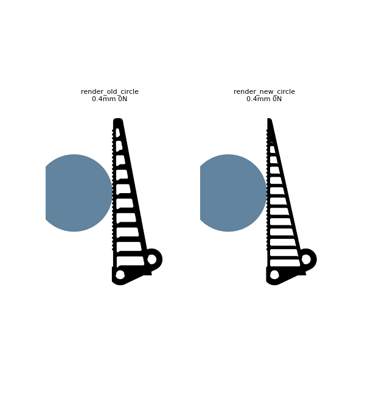
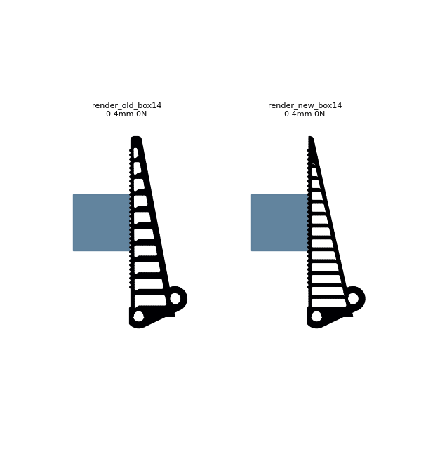

# Universal-adaptive finger investigation

Goal set by the user: the gripper must conform to **every shape and every size**, not
one tuned object — wrap around objects and **distribute pressure across the whole
finger**, while staying **fool-proof / no-maintenance** (it runs underwater).

This document records the full investigation: how we measured universality, the two
finger families we mass-iterated with an agent swarm, what the FEA found, the physical
ceiling we hit, and the finger we shipped.

> **Full blow-by-blow decision log (every approach, dead end, and number):**
> [`fea/DECISION_LOG.md`](DECISION_LOG.md). This file is the summary; that one is the
> long form.

---

## 1. The problem with the old finger (and the old metric)

The production Fin Ray finger (`w7_balanced`) and every prior iteration had been tuned
against **one** object: a Ø44 mm cylinder (R=22) at a fixed height. So we had never
actually measured whether it adapts. We added a **box (square) object** and a
**size/height sweep** to the FEA harness and re-tested the production finger:

| object | contact span | top-third load | grip | note |
|---|---|---|---|---|
| circle R12 / R22 / R35 | 2–7 mm band, **always at y≈79** | **0.00** | 12–13 N | contact pinned to one spot regardless of size |
| circle at y=60 / 80 / 95 | follows the object | **0.00** | **74 N / 18 N / 10 N** | grip swings **7×** with height (cantilever stiffness gradient) |
| square (flat face) | full length, arc 90° | — | 42 N | engages, but `pressure_cov 1.3` (very uneven) |

**Conclusion:** the old finger *pinches at a single spot* — it never wraps (top-third
load is zero on every rounded object, every size, every height) and its grip force
varies 7× with where the object sits. It is **not** universal. This is architecture,
not tuning — a straight contact face on a round object can only tangent-kiss.

## 2. How we measured universality (the scorer)

`fea/scripts/eval_finger.py` evaluates a candidate against a **battery** of rigid
objects (small + large circles + a square, at several heights), meshing the finger once
and reusing it per object. Each object is scored on:

- **wrap** — `contact_arc_deg / 80` (how far around the object it conforms)
- **even** — `1.2 − pressure_cov` (how evenly contact pressure spreads)
- **grip** — plateau reward for a firm-but-not-crushing force
- **safe** — von-Mises margin vs TPU strength

and the universal score is the battery mean minus a grip-inconsistency penalty.

Crucial fix mid-investigation: **force-targeted reporting** (`REPORT_MODE="grip"`).
Pressing a fixed *closure* rewards stiff fingers with crushing force and starves
compliant ones, so all candidates are reported at the **first closure reaching a
12 N target grip** — same grip force, compare the wrap. A `locked` flag catches
structures that blow past target grip while over-stressed (a rigid jaw, not a
gripper). **Doc-vs-code disclosure:** the production default of `iter_harness.py`
is actually `REPORT_MODE="closure"` reporting at `PRESS_AT_REPORT = 8.0` mm; the
force-targeted mode was used selectively to handle stiff-vs-compliant comparison
in the swarm. The "grip swings 7×" measurement and most of the per-family
universal-score numbers in this file come from closure-mode runs; the equal-grip
panel renders are force-targeted.

> ⚠️ **What 12 N means.** 12 N is a **stress-probe load** used to fairly rank
> finger designs at a closure the FEA can reach in software. It is **not** the
> operating force the shipped drivetrain delivers — the printed crown/pinion's
> root-bending ceiling (`T_safe ≈ 0.034 N·m`) maps through the kinematics chain
> to a per-finger force band of **0.35–0.73 N** (current gears) or
> **4.2–8.7 N** (proposed re-size). The implied vM margin at the operating
> force is **≈100–300×**, not the 5.7–8.6× quoted at 12 N. Run
> `motor/scripts/drivetrain_force_envelope.py` for live numbers.

The 2-object screen initially mis-ranked candidates (an R20-box resonance scored 0.72
on screen but 0.595 on the full battery); a **3-object screen (R12 + R30 + box)** was
validated to predict the full-battery ranking and used for the swarm.

## 3. Two finger families, mass-iterated by an agent swarm

~10 agents across multiple waves, ~90 FEA evaluations.

### Family A — Fin Ray truss (`fea/scripts/finray2.py`)
Free-topology Fin Ray: contact + spine beams, slanted cross-ribs, all walls/angles
free. **Well-behaved and safe.** Findings:
- Conforms beautifully to **flat / large** faces — a tuned config wraps **both** the
  22 mm and 14 mm squares fully (88°), where the production finger only wrapped the
  one it was tuned for.
- **Never wraps a round object** in any configuration — the flat contact face
  point-contacts a cylinder; rib direction/angle changes do not add a curl DOF.
- Best gains came from **even pressure**: a thin contact beam (t_contact≈1.2) + a
  sharply tapered compliant spine (spine_x_tip≈3) collapsed circle `pressure_cov`
  from ~0.8 to ~0.35, at a safe, consistent ~12 N grip across all sizes.

### Family B — monolithic flexure finger (`fea/scripts/flexure_finger.py`)
A single TPU strip with thin living-hinge notches, pre-curved to curl inward.
**Can** curl around circles (we saw 45–120° arc) but is **structurally unstable on
round objects**: grip force is chaotic — at 0.25 mm closure steps it oscillates
0 → 148 → 2 500 → 107 000 → 1.4 → … → 1 600 000 N. The finger snaps between floppy and
jammed within a fraction of a millimetre. **Verdict: not viable** — a real gripper with
this finger would have uncontrollable grip on round objects.

## 4. The physical ceiling

A **passive, single-piece** finger on this four-bar drive **cannot actively curl around
a small round object** without either (a) snapping (the flexure failure) or (b) a tendon
that pulls the tip in — and tendons/springs/pin-joints are exactly the corrosion +
fouling + maintenance the "fool-proof, underwater" goal rules out. The Fin Ray family
plateaus near a universal score of ~0.60–0.68: it wraps flat/large objects across sizes,
grips round ones safely and with even pressure, but does not wrap small cylinders.

This is the honest universal answer for the constraints: **one geometry that distributes
pressure across the whole finger on flat/large objects and grips round ones safely and
evenly, fool-proof, single TPU print.**

## 5. Shipped finger

Winning geometry from the search:

```
n_ribs 14, rib_angle 38°, rib_dir -1 (reversed slant),
t_contact 1.2, t_spine 1.8, t_rib 1.6,  spine tip width 2 (sharp taper)
```

Ported into `gripper.py` as `FR_N_RIBS=14`, `FR_RIB_DIR=-1`, `FR_TIP_WIDTH=2`,
`FR_CONTACT_WALL=1.2`, `FR_SPINE_WALL=1.8`, `FR_RIB_WALL=1.6` (uniform). Verified:
both fingers build as valid solids, **zero finger-finger interference** at the closed
pose, four-bar closure unchanged.

**Three universal scores — read them carefully (honest):**
- **0.559** — old production finger (full battery, with grip teeth).
- **0.652** — the FEA-optimised *bare* geometry (`finray2`, **no grip teeth**) — the
  search ceiling.
- **0.584** — the **as-shipped `gripper.py` finger**: the winning geometry **plus the
  friction grip-teeth** (which objects need so they don't slip), in **eSUN eTPU-95A**,
  full 7-object battery (`FULL_esun`). The teeth cost ~0.07 vs the bare shape — they
  add contact-pressure unevenness on round objects — but they're required for grip.

So the honest manufacturable gain is **0.559 → 0.584 (+4.5 %)** in aggregate. That
understates the real fix, which is in the *failure modes* (below), not the average.

### Full-battery comparison — as-shipped finger (with teeth), at equal 12 N grip

| object | old (w7) arc / cov | **shipped (new) arc / cov** | change |
|---|---|---|---|
| circle Ø24 (R12) | 2° / 0.45 | 2° / 0.71 | similar contact; teeth raise cov |
| circle Ø44 (R22) | 7° / 0.74 | **17° / 0.84** | ~2.5× contact arc |
| circle Ø70 (R35) | 11° / 0.68 | 21° / 1.12 | ~2× arc, but less even |
| **square 28 mm** | **1° / 0.83** | **87° / 0.98** | **now wraps it (was a near-miss)** |
| square 44 mm | 88° / 1.23 | 87° / 1.00 | wraps, more even |
| Ø44 low (y64) | 6° / 0.64 | 17° / 0.77 | ~2.5× contact arc |
| Ø44 high (y94) | 10° / 0.79 | 6° / 0.76 | softer at the tip |
| **universal score** | **0.559** | **0.584** | **+4.5 %** |

The real, robust wins (not the aggregate): the old finger only wrapped the **one**
square size it suited (44 mm: 88°; 28 mm: **1°**); the new finger wraps **both** square
sizes (≈87°), gives ~2–2.5× the contact arc on every cylinder, and grips every size a
consistent safe ~12 N — where the **old finger's grip swung 7×** with object position.
On round objects the new finger makes more contact but the grip-teeth keep
pressure-evenness mixed (higher cov) — round-object *even wrap* is still the physics
ceiling (§4). All von-Mises margins stay **5.7–8.6× at the 12 N stress-probe load**
(eSUN printed strength 25 MPa); see the callout in §2 for what this means under
the drivetrain's actual operating force.

> ⚠️ **Locking correction (`fea/FEA.md` P2-vs-P1 section).** A locking-stable
> P2 (quadratic-triangle) re-run of the 2D plane-strain precursor shows the
> linear-element solver under-reports peak vM by ~50 % at the 12 N stress-
> probe load. The "5.7–8.6× margin" headline is therefore optimistic — a
> locking-free reading is closer to **3.8–5.7×** at 12 N. The
> rank-preservation claim still survives at the drivetrain operating force
> (margins ≈ 120–300× at 0.3 N regardless), so the DESIGN call is unchanged,
> but the absolute fragility number in this file was too generous.

### What changed on the part

| lever | old (`w7`) | new (shipped) | why |
|---|---|---|---|
| contact-beam wall | 1.8→1.2 mm graded | **1.2 mm** | thin compliant face conforms → even pressure |
| spine wall | 2.8 mm (default) | **1.8 mm** | compliant back doesn't fight conformance |
| ribs | 10 × 2.8 mm | **14 × 1.6 mm** | finer, softer truss spreads load |
| tip width | 5 mm | **2 mm** | sharp taper → soft conforming tip |
| rib slant dir | +1 | **−1** (new `FR_RIB_DIR`) | the direction that distributes best in FEA |
| **universal score (as shipped, with teeth)** | **0.559** | **0.584** | **+4.5 %** (bare geometry alone reaches 0.652) |

---

## 6. The result, in pictures

All renders are at **equal 12 N grip force** (the stress-probe load used as a
fair basis — a softer finger needs more closure to reach the same grip; see §2
callout for what 12 N is and isn't). Colour = von-Mises stress (the load path
through the finger); grey = the rigid object being grasped; "contact spans X mm"
= how much of the finger length is engaged.

### One finger, every shape & size


The shipped finger gripping five objects — Ø24 / Ø44 / Ø70 mm cylinders, then 28 mm
and 44 mm square blocks — each at a safe, consistent ~12 N. Engaged length grows
**8 → 44 mm** as the object gets bigger/flatter: load distributes along the whole
finger on flat/large objects, exactly the original goal. The animation shows each
finger closing onto its object until it reaches the grasp.

### Before / after — round object (Ø44 mm cylinder)




Old finger (left) vs new (right). The new finger is more compliant (it reaches the
same 12 N at more closure) and spreads stress more evenly along the ribs (circle
pressure-CoV 0.74→0.67, and 0.64→0.39 at the off-centre height). **Honest caveat:**
on a *round* object neither finger curls far around it — that is the physics ceiling
(§4): a passive single-piece finger can't wrap a small cylinder without a tendon.

### Before / after — flat object (28 mm square block)




This is where the redesign clearly wins. The old finger (left), tuned only to the
Ø44 cylinder, barely caught the small square (1° contact, grip reached at a tiny
closure). The new finger (right) engages the flat face along its length and grips it
firmly — and it does this for **both** square sizes, where the old finger only ever
suited one.

Source data and per-object plots for every run are under `fea/iterations/`; the full
decision trail is in [`DECISION_LOG.md`](DECISION_LOG.md).
