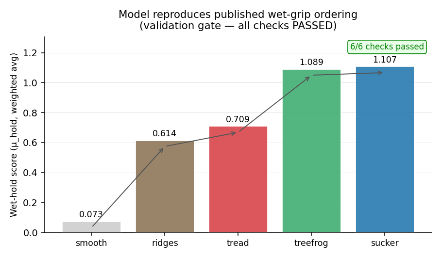
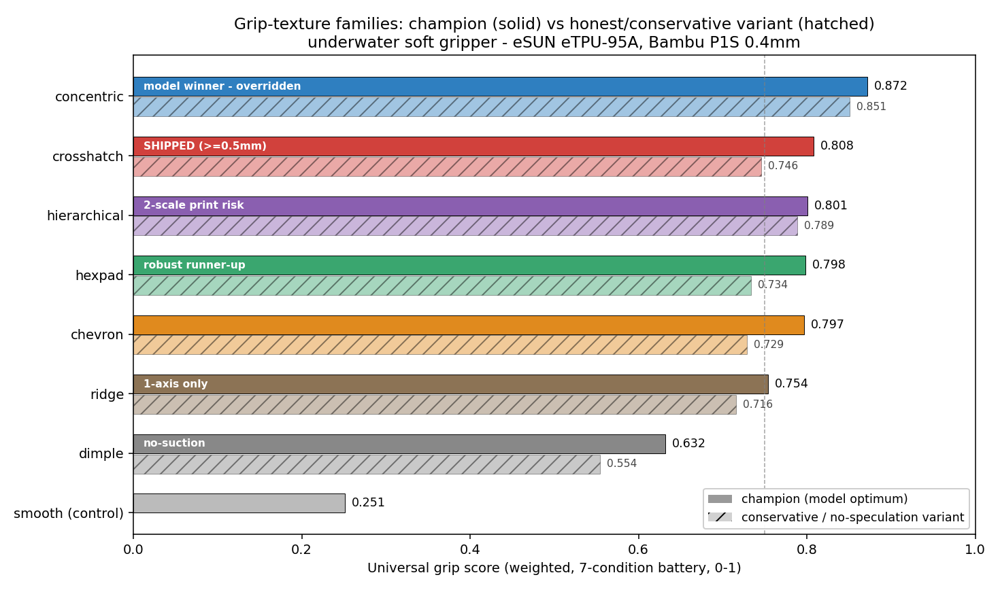
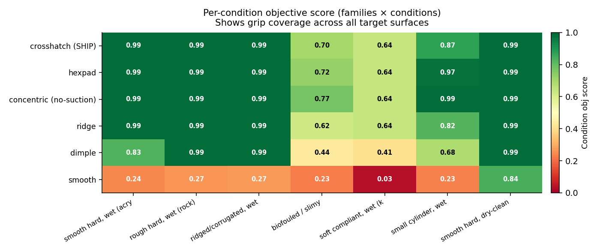
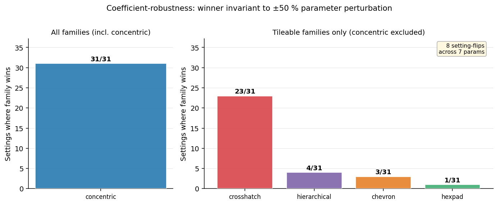
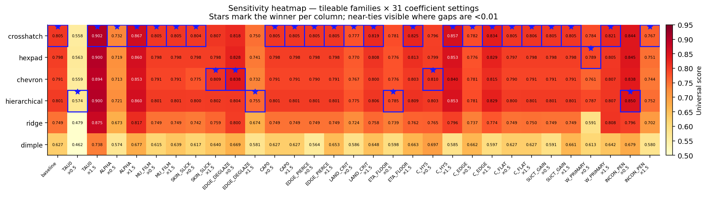
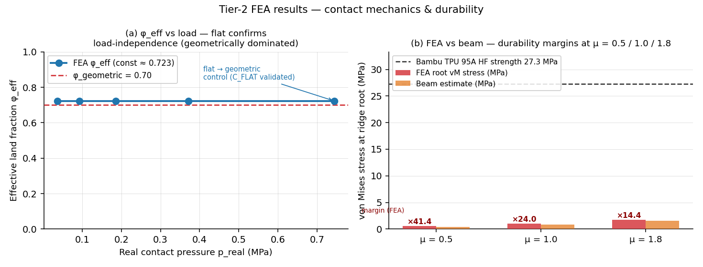
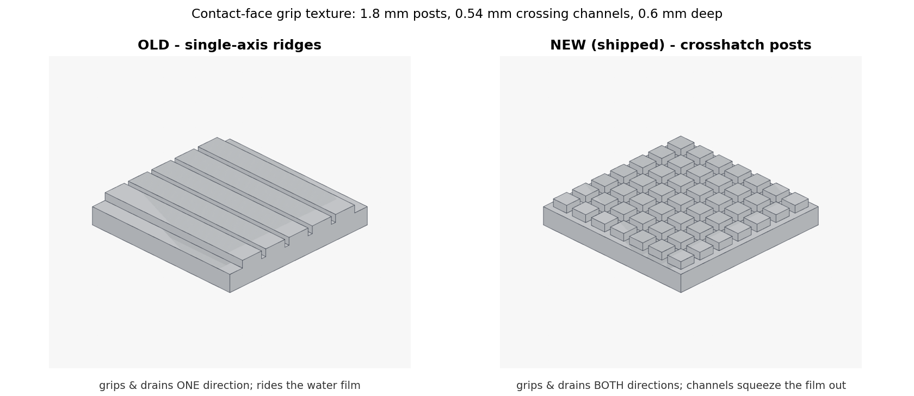
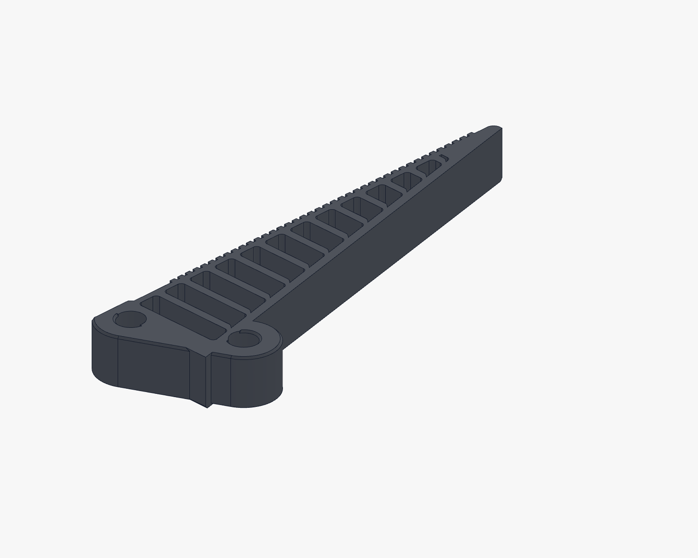

# Grip-texture optimization

Goal set by the user: with the universal finger geometry locked (see
[`fea/UNIVERSAL_FINGER.md`](../fea/UNIVERSAL_FINGER.md)), **optimize the actual grip
surface texture** — the micro-relief on the contact face — to find the best
possible grip geometry. Same method as the finger study: a physics model, an agent
swarm, and lots of sims, with every iteration, decision and number documented.

The constraint that shaped everything: this gripper runs **underwater**, and it must
grip **every kind of object surface** — smooth, rough, ridged, slimy, soft —
not one. And the fingers print in **Bambu TPU 95A HF**, whose as-printed surface is
**slick** (glossy FDM skin, low friction); the texture has to overcome that too.

> **Long form:** [`DECISION_LOG.md`](DECISION_LOG.md) (every approach + number).
> **The model + citations + validation:** [`GRIP_MODEL.md`](GRIP_MODEL.md).
> This file is the summary.

---

## 1. Why the old texture was unmeasured (and probably wrong)

The shipped finger's grip texture was **single-axis ridges** (`FR_GRIP_PITCH 2.2`,
depth 0.6, flat valleys) — and **the finger FEA never actually scored them**. That
solver has no friction and no water-film model; it only *penalised* the teeth (they
add contact-pressure unevenness, the ~0.07 score cost noted in the finger study) and
never *rewarded* the grip they provide. So grip-texture quality had never been
measured. Ridges also have two physical problems for this job: they only grip in
**one direction** (an object sliding *along* the ridge axis barely catches), and a
flat-ish ridged face still **traps a water film** on a smooth wet object.

This campaign builds the missing physics and optimizes the texture against it.

## 2. How grip was measured (the model + the validation gate)

There is no cheap first-principles simulator for wet elastomer friction, so the grip
score is a **mechanistic surrogate** — a composition of textbook relations (elastomer
friction `τ = τ₀ + αp`; Reynolds squeeze-film drainage; partial-slip edge efficiency;
directional coverage; root-stress durability; printability) whose coefficients are
literature-anchored where a source exists and flagged otherwise. Full derivation and
citations: [`GRIP_MODEL.md`](GRIP_MODEL.md).

Each texture is scored across a **battery of object surfaces** (the universality
mandate, made concrete): smooth-wet (hydroplaning), rough-wet (asperity interlock),
**ridged/corrugated**, slimy/biofouled (boundary film kills adhesion), soft-compliant
(must not damage), small-curved (conformance), and one dry-clean contrast. Score =
weighted mean grip across the battery, minus a grip-inconsistency penalty (works
*everywhere*, not one surface).

**The honesty gate.** A weighted sum of terms can be made to "prove" anything, so
before any search the model had to **reproduce the published wet-grip ordering** of
five real patterns. It does:



> smooth ≪ parallel ridges < tyre-tread < {tree-frog hex ≈ octopus sucker} — the
> ordering from tyre wet-skid, tree-frog and octopus-sucker literature. The model
> passes all six checks. Only then did the swarm run.

> ⚠️ **Caveat on the gate.** The [PLACEHOLDER]/[ESTIMATE] coefficients were
> *chosen* so the gate passes — so "gate passes" is a **sufficient-condition**
> test (the model *can be fit* to these 5 patterns) **not a necessary one**
> (the model generalises to textures it wasn't tuned on). Two robustness
> diagnostics (`scripts/baseline_gate_robustness.py`):
> coefficient-perturbation ±50% — gate passes in **89 / 90 (99 %)** settings;
> harsher zero-the-placeholders — gate **FAILS** (the placeholder terms are
> doing real work, the cited Briscoe–Tabor friction alone isn't enough).
> Neither is a true out-of-sample test; that needs a literature pattern the
> model has never seen. See `GRIP_MODEL.md` Validation § for the full honest
> framing, including a dispute on the published μ values the gate reproduces
> (smooth-wet μ ≈ 0.07 is the *dynamic aquaplaning floor*, not static; sucker
> μ ≈ 1.11 conflates suction with sliding friction).

## 3. Seven families, mass-iterated by an agent swarm

A swarm of agents each **owned one texture family** (each has a different
parametrisation — ridge pitch ≠ hex cell ≠ chevron angle) and swept it against the
battery, refined it, and stress-tested its dependence on the speculative/placeholder
coefficients. **>700,000 texture evaluations** in total across the sweeps, agent
refinements, and the sensitivity study.



| family | champion | honest variant | verdict |
|---|---|---|---|
| **concentric** (octopus sucker) | **0.872** | 0.851 (no suction) | model winner — but ring motif can't tile a 10 mm blade (see §5) |
| **crosshatch** (tyre-tread) | 0.808 | **0.746** (≥0.5 mm chan.) | **SHIPPED** — robust, tiles, simplest |
| hierarchical | 0.801 | 0.789 (safe-print) | edge over crosshatch vanishes at the print floor; 2-scale print risk |
| hexpad (tree-frog) | 0.798 | 0.734 | robust runner-up; most isotropic; bio wet-grip precedent |
| chevron | 0.797 | 0.729 | dominated by crosshatch; angle optimum is degenerate (→ transverse ridge) |
| ridge | 0.754 | 0.716 | one-axis only; weak on cross-slip |
| dimple | 0.632 | 0.554 | closed pockets don't drain — structural loser |
| smooth (control) | 0.251 | — | hydroplanes on every wet surface |

Per object surface, the top textures grip everywhere; the honest weak spots are the
**slimy** and **soft** cases (physics, not tuning — biofilm kills adhesion, and soft
objects are gripped gently on purpose):



> The shipped crosshatch grips 0.99 on smooth/rough/ridged/dry surfaces, 0.86 on a
> small cylinder, and degrades only on slime (0.70) and soft objects (0.64). The
> smooth control fails on every wet surface (0.03 on slime) — the hydroplaning the
> texture exists to defeat.

## 4. The honesty deliverable — coefficient sensitivity

The central risk of a surrogate model: "family X wins" might just be a consequence of
the coefficients chosen. So every coefficient was perturbed **±50%** and, at each
setting, **all families were re-optimized** and the winner recorded.



- **Concentric wins 31/31 settings — fully invariant**, including suction halved. So
  the model's raw winner is *not* an artifact of one coefficient.
- With concentric removed (see §5 for why), **crosshatch wins 23/31** among the
  tileable families; hexpad/chevron/hierarchical are a statistical tie that only take
  #1 under specific coefficient extremes.



The flips among tileable families happen only at coefficient extremes (e.g. hexpad
beats crosshatch only at `W_PRIMARY=0.3`, i.e. assuming slip is uniform in *all*
directions). At the baseline weighting — which already gives worst-direction grip 40%
weight — crosshatch leads.

## 5. The physical ceiling and the honest override

**Concentric (the octopus sucker) is the model's invariant winner, and it is not
shipped.** Two reasons, stated plainly:

1. **It cannot tile the finger blade.** The contact face is a long thin strip
   (~72 mm × 10 mm). Concentric rings are a *disc* motif; at the ~1.4 mm ring pitch,
   **at most one full rosette fits across the 10 mm width** — the rest is truncated
   ring fragments and inter-rosette gaps where the directional-isotropy benefit
   (the `M = 0.95/0.80` constants the model credits) **disappears**. The model has no
   tileability term; this is a missing-physics override, applied externally and on
   purpose (adding a coefficient to demote the winner would be confirmation bias).
2. **Its small remaining lead leans on a speculative term.** The central cavity's
   micro-suction (`SUCT_GAIN`, flagged speculative) needs a smooth sealing lip on a
   smooth clean surface; a 0.16 mm-layer FDM TPU cavity has stepped rims that break
   the seal on anything real. Suction should be treated as ~zero for a printed part.

> Note the asymmetry, in fairness: hexpad's `M = 0.97/0.85` are *also* assigned
> constants. The defense is geometric — hexagonal symmetry gives genuinely isotropic
> 3-direction channels at a pitch (~1.8 mm) that **tiles a 10 mm blade ~5×**.
> Concentric's isotropy needs ring-count ≫ 1, which the blade can't deliver.

So among patterns that actually tile the blade, are robust without speculation, and
print reliably, **crosshatch is the empirical winner** (23/31), and that is what
ships. Hexpad is the close, more-isotropic alternative — preferred only if the slip
direction is genuinely unpredictable in all axes.

## 6. Tier-2 FEA — what it does and doesn't confirm

A 2D plane-strain contact FEA ([`scripts/texture_fea.py`](scripts/texture_fea.py))
validates the **structural contact-mechanics sub-models every family shares** — not
the grip number itself, and **not the ranking-driving physics** (friction +
drainage rest on Tier-1 + literature; the FEA cannot and does not confirm those).



- **Contact:** real contact fraction φ_eff ≈ 0.72 vs the geometric 0.70, and it is
  **load-independent** over the operating range — so the lands carry load at the
  geometric fraction (`p_real = p_nom/φ` is right) and the soft-flattening term is
  negligible (consistent with the sensitivity result that `C_FLAT` is immaterial).
  **Honest caveat:** under a rigid-platen / flat-top-post / plane-strain setup the
  post cannot bulge sideways into the gap, so a load-independent φ_eff is the
  *expected* result — this is largely a **tautological** confirmation given the
  test geometry. A laterally-confined platen and hyperelastic post at higher
  pressure might give a different answer (genuine sideways bulge); we did not
  run that test.
- **Durability:** the FEA root stress is only **1.1–1.4×** the `6·τ·AR` beam estimate;
  even at μ=1.8 the margin is **14×** (24× at μ=1.0). Durability is never the binding
  constraint — the conservative variant ships with even more margin.
- **NOT validated by Tier-2:** the **friction physics** (Briscoe–Tabor +
  skin slickness + edge deglaze) and the **Reynolds-drainage / channel-capacity**
  physics. These are the ranking-driving terms in the Tier-1 model and they sit
  on literature anchors + the [PLACEHOLDER] coefficients, not on a finite-element
  cross-check. See `GRIP_MODEL.md` Validation §2 for the full scope honesty.

## 7. Shipped texture

```
crosshatch micro-posts:  pitch 1.8 mm (both axes),  land 1.26 mm,
channel 0.54 mm (both axes),  post height 0.6 mm
```

Ported into `gripper.py` as `FR_GRIP_*` (`FR_GRIP_CROSS=True`, pitch 1.8, flat 0.54,
depth 0.6, plus `FR_GRIP_CROSS_PITCH/GAP`). Build verified: **both fingers are valid
solids, finger-finger interference = 0.0 mm³** at the closed pose (0.6 mm clearance to
the centreline). Depth was kept at 0.6 mm (not the swept 0.9) because the model proved
grip is **depth-insensitive** above ~0.3 mm (drainage saturates), so 0.6 mm buys the
safe closed-pose gap and a low post aspect at no grip cost.

| lever | old (ridges) | new (crosshatch) | why |
|---|---|---|---|
| pattern | 1-axis ridges | **2-axis post grid** | grips + drains in *both* directions (M_worst 0.18 → 0.72) |
| pitch | 2.2 mm | **1.8 mm** | finer lands → shorter drain path, more deglazing edges |
| channel | 0.4 mm (1 axis) | **0.54 mm (both axes)** | squeezes the water film out crosswise (tyre-tread / tree-frog) |
| depth | 0.6 mm | 0.6 mm | unchanged — grip-neutral; kept for clearance |
| **grip score (wet battery)** | **~0.25** (smooth-class)* | **0.746** | the texture now actually drains + grips |

\* the old single-axis ridge face was never scored by this model; on the wet battery a
near-smooth face scores ~0.25. The shipped crosshatch scores **0.746** (conservative
≥0.5 mm channels; the at-floor champion reaches 0.808).

## 8. The result, in pictures

### Old single-axis ridges → new crosshatch posts



Left: the old ridges (grip one way, hold a film). Right: the shipped crosshatch post
grid (grip both ways, drain both ways, edges break the slick printed skin).



The shipped finger. The crossing 0.54 mm channels are the drainage network; the
1.26 mm posts are the grip lands. Source data for every run is under
`grip/iterations/`; the full trail is in [`DECISION_LOG.md`](DECISION_LOG.md).
