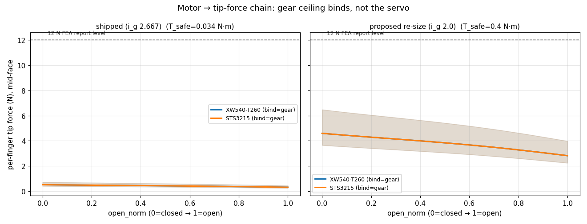
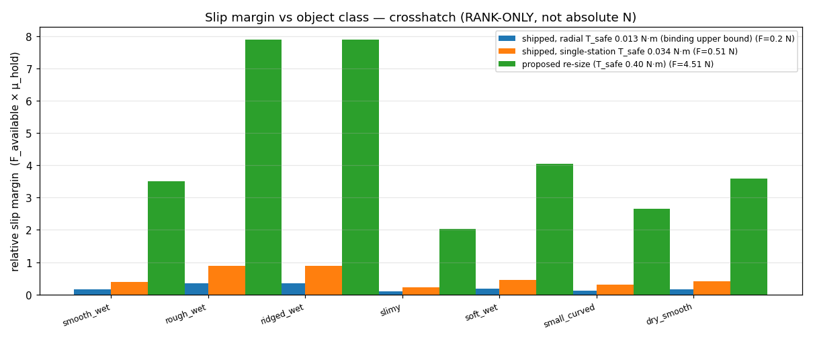

# The actuator & sensing study — how we chose the drive and made it the sensor

Flagship, judge-facing account of the `motor/` campaign: how the gripper's
actuator was specified, surveyed, selected, structurally re-checked, and turned
into the gripper's own grip-force sensor. The analog of `fea/UNIVERSAL_FINGER.md`
(finger) and `grip/GRIP_TEXTURE.md` (texture) — for the drive.

> **RANK / SIZE, NOT ABSOLUTE-NEWTON CERTIFICATION.** Every torque↔force relation
> here is exact kinematics from `gripper.py`; but the efficiency band, the PA12-GF
> gear allowable, and the contact compliance are **engineering estimates, not
> hardware measurements**, and the actuator specs are **datasheet/retailer figures**.
> This study sizes the actuator, sets the gear current-limit ceiling, and ranks
> options + object-slip risk. It does **not** assert a grip force in newtons or a
> certified depth — those come from `BENCH_TEST.md`. The force *readout* is a
> **relative** signal until load-cell-calibrated (`SENSING.md`). Same honesty rule
> the finger-FEA and grip-texture campaigns ran under.

---

## 1. The innovation — the motor *is* the force sensor

The gripper does not carry fingertip pressure sensors. Instead the **actuator's own
motor current is the grip-force signal**: current → motor torque → back-traced
through the drivetrain → estimated tip force. This is exactly how force-controlled
industrial and surgical grippers work (Maxon, Robotiq, Schunk). The payoff for an
underwater tool is decisive:

- **Zero added fingertip electronics underwater** — no wires through the flexing TPU
  finger, no fingertip connector to flood. (The earlier conductive-foam concept is
  removed, `DECISION_LOG.md` D5.)
- **The same channel that drives the gripper senses it** — a smart serial servo
  streams `present_current` on the same bus that commands position.
- **The current limit is also the gear protection** — see §5.

That is a stronger, more defensible innovation story than a bolt-on sensor: *the
force-sensing comes free with the actuator we already need.*

## 2. The campaign in seven acts

| Act | Doc | What it established |
|---|---|---|
| 1. Requirements | `REQUIREMENTS.md` | From the live four-bar: input torque **0.56–1.18 N·m** for 12 N/finger, travel only **123°** (limited-rotation OK), + the sensing budget (≥ 50 Hz, ≤ 0.3 N tip step) |
| 2. Survey | `SURVEY.md` | 12-agent swarm, 7 actuator classes × 5 sensing modalities, every spec datasheet-sourced |
| 3. Selection | `SELECTION.md` | Weighted score + ±50 % sweep across depth tiers → the class flips with depth |
| 4. Drivetrain | `DRIVETRAIN.md` | Gear FEA → the crown/pinion is the structural limiter (the big finding) |
| 5. Sensing | `SENSING.md`, `MOTOR_MODEL.md` | Forward + inverse model, calibration, noise floor, limits |
| 6. Integration | `ROV_INTEGRATION.md`, `ELECTRICAL.md` | Mount, isolation, cabling, tether power, telemetry channel |
| 7. Validation plan | `BENCH_TEST.md`, `FAILURE_MODES.md` | What to test, pass/fail, and what fails first |

## 3. The sensing pivot reshuffles the field

Before sensing, the obvious pick was simply the best-sealed servo. After the
**actuator-as-sensor filter (R10)**, that flips:

- **The best-*sealed* option is eliminated:** Blue Trail Engineering's 200–400 m
  servos are open-loop PWM with **no current telemetry → DEAD** for this design.
- **Sensorless BLDC is a trap:** back-EMF estimators go **blind at stall** — exactly
  the grip-and-hold state — so they are contact-detection only.
- **The winners deliver seal *and* sense:** smart serial-bus servos
  (`present_current`), FOC BLDC (`iq`), or either inside a magnetically-coupled pod.

## 4. Selection — and why the actuator class flips with depth

Weighted multi-criteria (sensing 0.25, depth 0.20, torque 0.15, modularity 0.15,
integration 0.10, holding 0.07, cost 0.08), swept ±50 %:

| | T1 ≤ 10 m | **T2 ≤ 30 m (primary)** | T3 > 30 m |
|---|---|---|---|
| winner | smart serial servo | **smart serial servo (13/14 stable)** | magnetic-coupling pod (13/14) |

**Same gripper, same D-coupler — the optimal drive shifts from smart-serial-servo
(shallow) to magnetic-coupling (deep) as depth matters more.** That is the modular-
product thesis, quantified.

- **PRIMARY (T2): DYNAMIXEL XW540-T260(-R)** smart serial servo — IP68 body, ~1.9 N·m,
  RS-485, native `present_current` (≈ 0.005 N·m/step) held cleanly at stall.
  **Buy:** [ROBOTIS US store — DYNAMIXEL XW540-T260-R](https://robotis.us/dynamixel-xw540-t260-r/),
  **USD 1,241.89** (≈ AUD 1,925; official store, verified May 2026; the `-R` suffix
  = RS-485, the multi-drop bus variant).
- **SECOND OPTION — just as good for ~40 % the price (≤ $500): DYNAMIXEL XM540-W270-R.**
  The **same Dynamixel-X RS-485 ecosystem** and the **identical native `present_current`**
  telemetry (2.69 mA/step) as the primary — and actually **more torque** (cont ≈ 2.12 N·m,
  stall 10.6 N·m, vs the XW540's 1.9 / 9.5). It is a **drop-in**: same bus, same control
  code, same firmware current-limit, same sensing model. **Buy:**
  [ROBOTIS US store — DYNAMIXEL XM540-W270-R](https://robotis.us/dynamixel-xm540-w270-r/),
  **USD 494.39** (≈ AUD 766; in stock, verified May 2026). The *only* difference is it has
  **no IP68 body** — but at the T2 (≤ 30 m) design point the XW540's IP68 is just 1 m
  freshwater and needs a pressure canister anyway, so **in the canister the two are
  functionally equivalent**, making the XM540-W270 the better value. (For pure bench/T1,
  the **Feetech STS3215**, ~AUD 34, is the rock-bottom option; STS3250 ~USD 88 the mid step.)
- **FALLBACK (T3): magnetic-coupling dry-pod** — no shaft penetration → depth set
  only by static pod seals; pole-slip is a built-in force limiter; sensing inherited
  from the pod motor.

## 5. The big finding — the drivetrain, not the actuator, is the limit

A 2D plane-stress FEA of the printed teeth (`gear_fea.py`, cross-checked vs Lewis)
showed the compact **right-angle crown/pinion stage is grossly under-sized** for the
torque a 12 N grip needs (working ≈ 0.94 N·m at η ≈ 0.5; tooth force ≈ 313 N on a
0.67-module pinion). Safe input torque:

| geometry | T_safe | achievable safe grip |
|---|---|---|
| as-was | 0.02 N·m | < 0.5 N |
| **shipped** (face-width strengthened: PINION_T 4→8, CROWN_TOOTH_H 1.6→3.0, build-verified) | **0.034 N·m** | ~0.5 N |
| **proposed re-size** (CROWN_RC 11, module 1.83, 12/6 teeth — needs CAD validation) | **0.40 N·m** (realistic ~0.80) | ~5–9 N |



*The gear ceiling binds, not the servo — both servos hit the same `T_safe` cap.*

This reframes everything honestly: **12 N is the finger-FEA fair-comparison report
level, not a structural mandate; the achievable safe grip is what the drivetrain
envelope permits.** The motor **current limit enforces `T_safe` in firmware — that is
the gear protection** (mandatory on both servos, whose stall ≫ `T_safe`). And it is
precisely why the **magnetic-coupling fallback is strong**: its pole-slip torque
scales with coupling *diameter*, not the cramped housing radius (a 60–80 mm coupling
clears the stall band), so it removes the bottleneck the geared stage can't.

## 6. Slip margin vs object class (rank-only)

Coupling the force chain to the wet-grip model (`grip_model.py`) for the shipped
crosshatch texture:



*Biofouled/slimy is the worst object class; rough/ridged the best. The available
force scales the whole curve — which is why the re-size matters for hard objects.*

## 7. Holding, stall, back-drive

`holding_stall.py`: the chain is **back-drivable** (no worm) → a positional servo
holds actively (an unpowered chain releases — a safety note in `FAILURE_MODES.md`).
Holding current is **sub-amp** (the gear-limited torque is tiny vs `K_t`), so
sustained grip-hold is thermally trivial. The **stall current** sets the bus/fuse
budget (XW540 ≈ 5.1 A, STS3215 ≈ 2.7 A) — size for stall, not run (`ELECTRICAL.md`).

## 8. What is proven vs what needs the bench

- **Established (analysis):** the torque chain + travel (exact kinematics); the
  selection ranking + its ±50 % robustness; the gear structural limit + `T_safe`;
  back-drivability; the sensing resolution/rate budget; the slip-risk ordering.
- **Not established (needs `BENCH_TEST.md`):** the absolute grip force in newtons;
  the absolute depth rating; the current→force calibration accuracy on real
  hardware; endurance/wear; whether the proposed re-size's clearance is buildable.

> **The honest headline for judges:** *we did not "pull a number out of thin air."*
> Every figure traces to the live CAD, a sourced datasheet, or a reproducible sim,
> and the one uncomfortable result — that the printed gear stage caps grip below the
> finger's capability — is **surfaced, quantified, and turned into a design driver**
> (the current limit, and the magnetic-coupling fallback), not hidden.

## 9. Reproduce + cross-links

```bash
python motor/scripts/kinematics_chain.py   # torque<->force chain + travel
python motor/scripts/gear_fea.py           # gear ceiling T_safe (+ proposed re-size)
python motor/scripts/check_drivetrain.py   # interference of the strengthened gears
python motor/scripts/torque_chain.py       # motor -> tip force (plot)
python motor/scripts/slip_margin.py        # slip margin vs object class (plot)
python motor/scripts/holding_stall.py      # holding/stall current + back-drive
python motor/scripts/selection_score.py    # weighted selection + sensitivity
python motor/scripts/motor_sensitivity.py  # +/-50% envelope
```

Docs: `REQUIREMENTS.md` · `SURVEY.md` · `SELECTION.md` · `DRIVETRAIN.md` ·
`MOTOR_MODEL.md` · `SENSING.md` · `ROV_INTEGRATION.md` · `ELECTRICAL.md` ·
`BENCH_TEST.md` · `FAILURE_MODES.md` · `DECISION_LOG.md`. Siblings:
`../fea/UNIVERSAL_FINGER.md`, `../grip/GRIP_TEXTURE.md`, `../TESTING_AND_SIMULATION.md`,
`../UNDERWATER.md`.
